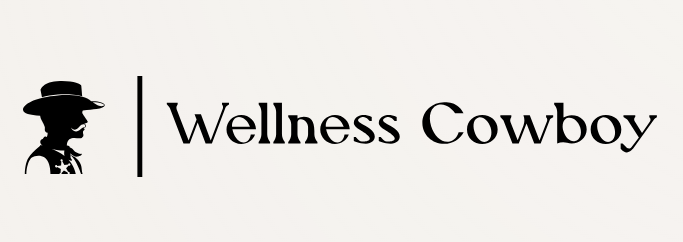

# Wellness Cowboy

	

<!-- Insert logo + tagline -->
## Overview 

This project is aimed towards keeping a good work-life balance, but not in terms of hour; instead we see balance as not having to worry about your work outside of work, and not being tortured whilst doing it. Which is why we made Wellness Cowboy! It's an app that reminds us that our peace-of-mind is gift we are given and we should protect it.

## How it Works 

Finally, my favourite part! where I get to tell you about everything we did and didn't do to make this dream happen. Our goal in this project is to measure the user's stress by constantly monitoring them as they're working. If at a certain point it goes above a certain threshold the user is then prompted to some calming exercises to clear their mind and forget about work for a while. We also use an *Amazon Dot Echo* to better communicate with the user.

## Challenges we ran into

We ran into many challenges... It's easier to say what things went right than wrong 🤣. However there are two that are worth mentioning: 1. Amazon Echo Dot: This GOD FORSAKEN PIECE OF TECHNOLOGY is not meant to exist. it shall be burnt in FIRE 🔥. From the lack of API documentation to delays in deployment to lack of debugging tools, I can go on for days of how badly supported this piece of technology is, enough tho. Let's get to challenges of detecting what people are masters at hiding, stress. It's hard to detect stress solely based off of facial expressions, since it goes beyond just the face, like feet, hand, sweating, and switching spots in one place a lot. We could not find a single AI model that was specifically trained for completing this task which is why we pivoted to LLMs to solve the issue to which we had great success.

## Technology

**Frontend**: Jinja, JavaScript, HTML, CSS

**Backend**: FastAPI ❤️, OpenAI, MediaPipe (extracting facial points & features), OpenCV

## Our Team ##

- [@dolev497](https://github.com/Dolev497) Dolev Klein
- [@pooriaahmadi](https://www.github.com/pooriaahmadi) Pooria Ahmadi
- [@jaskiratkaur1906](https://github.com/jaskiratkaur1906) Jaskirat Kaur
- [@2135500-Garand-Cedric](https://github.com/2135500-Garand-Cedric) Cédric Garand

